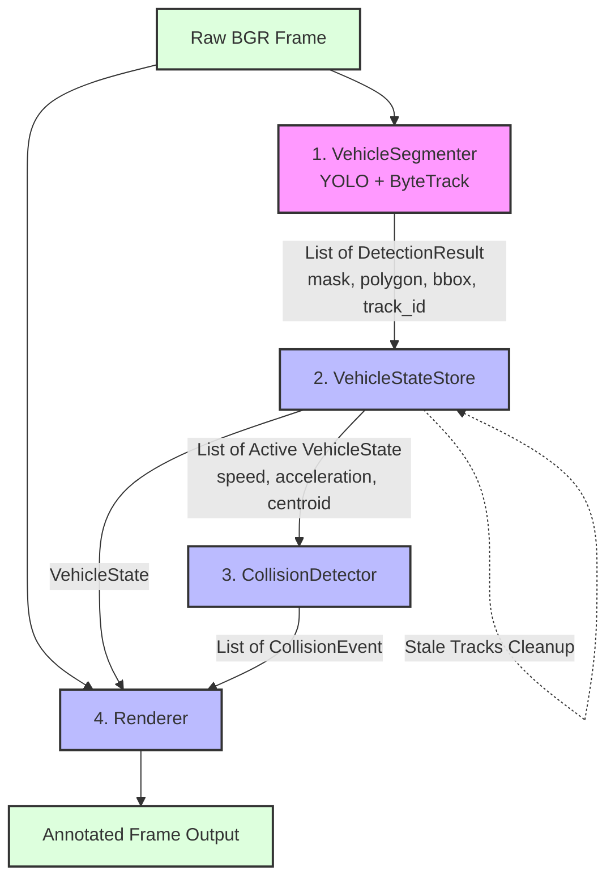

# Traffic Accident Detection System: A Kinematic and Instance Segmentation Approach

## Abstract
This report presents a comprehensive, detailed analysis of a custom traffic accident detection system. The project leverages advanced computer vision techniques, specifically real-time instance segmentation and multi-object tracking, combined with deterministic kinematic physics to identify potential collisions between vehicles in video streams. By analyzing the pixel-level overlap of vehicle masks alongside behavioral anomalies—such as sudden decelerations or simultaneous stops—the system aims to accurately detect crashes while mitigating false positives caused by simple visual occlusions (e.g., vehicles passing each other in different lanes). This document extensively reviews the architecture, the methodologies, the data flow pipeline, the underlying detection logic, the current physical and computational limitations, and potential future improvements.

## Used Techniques & Methods
The project is built entirely in Python and relies on a combination of state-of-the-art computer vision libraries and robust mathematical modeling. The core components include:
*   **Ultralytics YOLO (You Only Look Once):** Utilized for real-time instance segmentation. Unlike standard object detection, this model extracts precise pixel-level binary masks and normalized polygons for each detected vehicle, which is crucial for determining true physical proximity.
*   **ByteTrack:** Employed for robust, persistent multi-object tracking across sequential frames. It associates YOLO detections frame-by-frame, allowing the system to maintain consistent vehicle identities (track IDs) and calculate continuous, stable trajectories over time.
*   **OpenCV & NumPy:** Used extensively for low-level image processing, geometric transformations, matrix operations (e.g., bitwise intersections of masks), and bounding box/polygon calculations.
*   **CustomTkinter & Pillow:** Used to build a modern, hardware-accelerated Graphical User Interface (GUI) to interact with the underlying video processing pipeline.

**Hardware Specifications:**
The software architecture is explicitly designed and optimized to run on standard consumer hardware without the need for specialized tensor accelerators. Specifically, the system is configured to execute efficiently on a laptop with the following specifications:
*   **CPU:** AMD Ryzen 5 7530U
*   **RAM:** 16GB
*   **GPU:** No dedicated video card (CPU-only inference).

## Pipeline Data Flow

The system processes video files frame-by-frame through a strictly coordinated, 4-step deterministic pipeline. The orchestrator for this flow is defined in `src/video_pipeline.py`. Below is the architectural diagram illustrating the exact flow of data through the system components.

## Core Modules Description

The application is structured into highly cohesive, specialized modules that guarantee separation of concerns. Below is a detailed breakdown of the primary Python files handling the logic:

### `video_pipeline.py`
This module acts as the **Orchestrator**. It initializes all other subsystems and defines the `TrafficAccidentPipeline` class. For every frame of the video, it executes the pipeline in an exact deterministic order: it calls the detector, updates the kinematic states, purges stale tracks, runs the collision logic, and finally overlays the graphical annotations using the renderer. It is the central nervous system connecting the data flow.

### `detector.py`
This file implements the **Vision Layer**. It contains the `VehicleSegmenter` class, which wraps the YOLO model and the ByteTrack algorithm. Its primary responsibility is to accept a raw BGR frame and return a list of `DetectionResult` objects. It abstracts away PyTorch tensors by converting them into standard Python lists and OpenCV-compatible NumPy arrays (polygons, bounding boxes, binary masks), ensuring that the rest of the application does not tightly couple to the Ultralytics API.

### `tracker_state.py`
This module acts as the **Memory Store**. The `VehicleStateStore` maintains active vehicles and a bounded history of motion samples. Duplicate detections for one track ID are collapsed by confidence. Motion is measured from the bottom-center bbox anchor, normalized by the observed frame gap, and invalidated after long gaps. Stale tracks are removed to prevent memory leaks and ghost collisions.

### `kinematics.py`
A pure math module defining the **Physical Rules**. It operates on generic 2D coordinates without importing internal project models. It exports vector velocity normalized by elapsed frames, scalar speed and acceleration, an exponential moving average, and the consecutive stopped-frame counter.

### `geometry.py`
A low-level spatial module defining the **Shape Computations**. It relies heavily on OpenCV and NumPy to process geometric entities. It includes functions like `safe_polygon_array` to normalize raw YOLO shapes into int32 OpenCV arrays, `polygon_to_binary_mask` to render polygons into uint8 full-frame pixel masks, `compute_centroid_from_polygon` which uses image moments ($m_{10}/m_{00}$) to find the precise center of mass, and `mask_intersection_area` which uses bitwise AND operations to calculate the exact overlapping pixel count between two vehicles.

### `collision_logic.py`
This module embodies the **Business Logic**. The `CollisionDetector` maintains persistent state for every ordered pair of tracks. It combines normalized spatial contact with recent motion, hard deceleration, and movement-to-stop transitions. Candidate evidence is confirmed over time and followed by a cooldown, so a sustained crash produces one event rather than one event per frame.

## Crash Detection Logic
The detector no longer requires exact mask overlap in one frame. Its current flow is:

1. **Track kinematics:** a bottom-center motion anchor is measured over the actual frame gap and its velocity is filtered with an exponential moving average. New tracks and tracks returning after a long gap do not provide valid impact evidence.
2. **Spatial candidate:** bbox distance is used as an inexpensive pre-filter. Exact overlap is evaluated both in pixels and as `intersection/min(mask areas)`. Slightly dilated masks also detect adjacent silhouettes that touch without sharing pixels.
3. **Temporal evidence:** contact and a dynamic anomaly may occur within `impact_window_frames`. A stop is accepted only if recent history proves that at least one vehicle was moving.
4. **Confirmation and cooldown:** evidence must persist for `collision_confirmation_frames`; after confirmation, the pair enters cooldown and cannot emit duplicate events.

`CollisionEvent` records the strongest overlap, relative closing speed, kinematics, first contact frame, confirmation frame, and an explainable confidence score.

### Calibration and Evaluation
When `calibration_log_path` is enabled, the pipeline writes JSON Lines records
for pair-level diagnostics and unique collision events. The `src.calibration`
module reads `dataset/metadata-real.csv` directly. It records the decoder's
timestamp for each prediction and compares it with `accident_time`, while
`accident_frame` remains a parallel metric and a fallback for older logs.
Predictions are matched one-to-one within a temporal tolerance and delay is
reported in frames and seconds. The `src.benchmark` runner supports
dataset splits, accident-type filters, resumable execution, throughput and
real-time-factor measurements, plus breakdowns by accident type and
environmental metadata. Pair diagnostics are optional during batch runs
because their size grows with every vehicle pair and frame.

The current real dataset contains 2,027 metadata rows and 2,027 corresponding
MP4 files, with no missing or duplicate paths. Its accident distribution is
680 single-vehicle, 657 t-bone, 328 rear-end, 245 sideswipe, and 117 head-on
videos. Metadata validation is included in the generated report; two current
rows place `accident_frame` exactly at `no_frames`, so timestamp-based matching
is especially important for those end-of-video annotations.

Every real-dataset video contains an annotated accident. Consequently, this
benchmark measures missed, mistimed, and duplicate detections, but cannot by
itself estimate the false-alarm rate on accident-free traffic. A representative
negative-video set is still required for deployment-level precision claims.

## Issues
While the current deterministic approach is computationally efficient, explainable, and capable of running on low-end hardware, it is subject to several physical and technical limitations:
*   **Lack of Perspective Awareness:** The kinematic calculations (speed, acceleration) are currently performed in the 2D pixel space rather than real-world Euclidean coordinates. Consequently, the apparent speed of a vehicle varies drastically depending on its distance from the camera focal point (perspective distortion), requiring very generic and potentially inaccurate thresholding.
*   **Hardware Constraints:** Running an instance segmentation model (YOLO) and a tracker entirely on a CPU (AMD Ryzen 5 7530U) heavily limits the processing framerate. A low framerate can cause the system to miss rapid kinematic changes (the spike in deceleration) that occur between the processed frames.
*   **Environmental Sensitivity:** The accuracy of the YOLO segmenter heavily degrades in adverse weather conditions (rain, fog, snow) or poor lighting (nighttime). If the masks are poorly segmented, the pixel-level overlap condition becomes unreliable.
*   **Tracker ID Switching:** If ByteTrack loses a vehicle during a severe occlusion (common during a crash) and reassigns a new ID when the vehicle reappears, the kinematic history (speed, previous centroids) is reset. This prevents the detection of "Hard Deceleration" since the velocity differentials cannot be computed across the ID switch.

## Future Improvement
To address the aforementioned issues and push the system towards enterprise-grade robustness, the following architectural and mathematical improvements are recommended:
1.  **Bird's Eye View (BEV) Transformation:** Implementing an Inverse Perspective Mapping (IPM) using a homography matrix. By manually selecting 4 ground-plane points, the system could project the 2D image coordinates into a top-down 3D metric space. Speeds and accelerations would then be calculated in real-world metric units (meters per second) rather than pixels, standardizing the detection thresholds across the entire video frame.
2.  **Hardware Acceleration via Optimization:** Integrating inference engines like ONNX Runtime, OpenVINO, or NCNN could significantly boost the YOLO model's execution speed on CPU-only environments, enabling near-real-time processing and capturing finer kinematic details.
3.  **Hybrid Deep Learning Approach:** Instead of relying entirely on deterministic rules, a temporal neural network (such as an LSTM or an action-recognition Transformer) could be trained on the extracted kinematic features (trajectories, speed vectors, overlap ratios) to classify crash patterns more dynamically, learning to ignore complex false positives.
4.  **Kalman Filter Enhancements:** Tuning the ByteTrack's internal Kalman filter state estimation to better predict a vehicle's position during severe occlusions, maintaining the track ID even when a vehicle is temporarily hidden behind a larger vehicle during a pile-up.

## Conclusions
The implemented traffic accident detection system represents a modular and explainable approach to road safety monitoring. Instance segmentation now supplies spatial candidates while filtered track history and persistent pair state provide temporal confirmation. This reduces the most obvious false positives from stationary traffic and duplicate per-frame alerts, but it does not make mask contact proof of a physical crash. Perspective calibration, video-level validation, and robust ID reassociation remain necessary before deployment.
