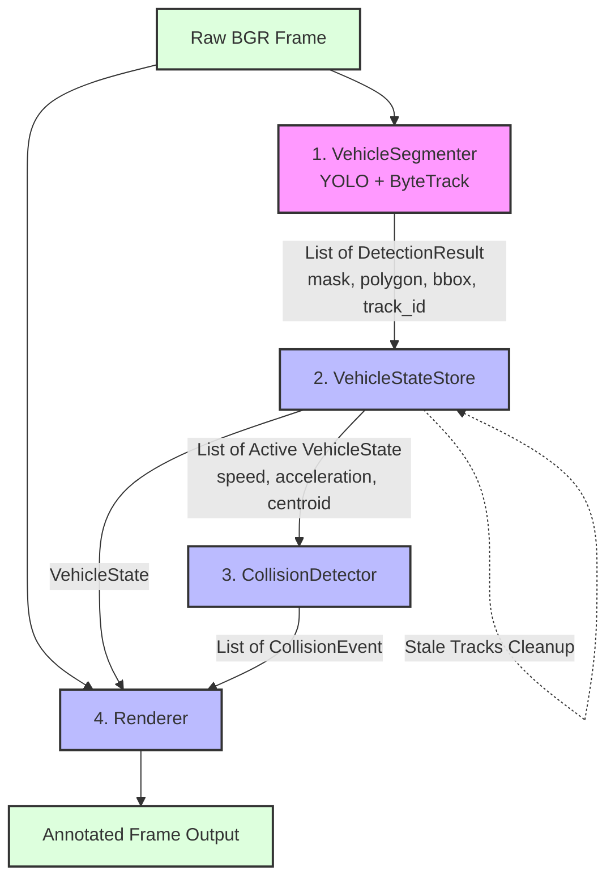

# Traffic Accident Detection System: A Kinematic and Instance Segmentation Approach

## Abstract
This report presents a comprehensive, detailed analysis of a custom traffic accident detection system. The project leverages advanced computer vision techniques, specifically real-time instance segmentation and multi-object tracking, combined with deterministic kinematic physics to identify potential collisions between vehicles in video streams. By analyzing the pixel-level overlap of vehicle masks alongside behavioral anomalies—such as sudden decelerations or simultaneous stops—the system aims to accurately detect crashes while mitigating false positives caused by simple visual occlusions (e.g., vehicles passing each other in different lanes). This document extensively reviews the architecture, the methodologies, the data flow pipeline, the underlying detection logic, the current physical and computational limitations, and potential future improvements.

## Used Techniques & Methods
The project is built entirely in Python and relies on a combination of state-of-the-art computer vision libraries and robust mathematical modeling. The core components include:
*   **Ultralytics YOLO (You Only Look Once):** Utilized for real-time instance segmentation. Unlike standard object detection, this model extracts precise pixel-level binary masks and normalized polygons for each detected vehicle, which is crucial for determining true physical proximity.
*   **ByteTrack:** Employed for robust, persistent multi-object tracking across sequential frames. It associates YOLO detections frame-by-frame, allowing the system to maintain consistent vehicle identities (track IDs) and calculate continuous, stable trajectories over time.
*   **OpenCV & NumPy:** Used extensively for low-level image processing, geometric transformations, matrix operations (e.g., bitwise intersections of masks), and bounding box/polygon calculations.
*   **CustomTkinter & Pillow:** Used to build a modern, hardware-accelerated Graphical User Interface (GUI) to interact with the underlying video processing pipeline.

**Hardware Specifications:**
The software architecture is explicitly designed and optimized to run on standard consumer hardware without the need for specialized tensor accelerators. Specifically, the system is configured to execute efficiently on a laptop with the following specifications:
*   **CPU:** AMD Ryzen 5 7530U
*   **RAM:** 16GB
*   **GPU:** No dedicated video card (CPU-only inference).

## Pipeline Data Flow

The system processes video files frame-by-frame through a strictly coordinated, 4-step deterministic pipeline. The orchestrator for this flow is defined in `src/video_pipeline.py`. Below is the architectural diagram illustrating the exact flow of data through the system components.

## Core Modules Description

The application is structured into highly cohesive, specialized modules that guarantee separation of concerns. Below is a detailed breakdown of the primary Python files handling the logic:

### `video_pipeline.py`
This module acts as the **Orchestrator**. It initializes all other subsystems and defines the `TrafficAccidentPipeline` class. For every frame of the video, it executes the pipeline in an exact deterministic order: it calls the detector, updates the kinematic states, purges stale tracks, runs the collision logic, and finally overlays the graphical annotations using the renderer. It is the central nervous system connecting the data flow.

### `detector.py`
This file implements the **Vision Layer**. It contains the `VehicleSegmenter` class, which wraps the YOLO model and the ByteTrack algorithm. Its primary responsibility is to accept a raw BGR frame and return a list of `DetectionResult` objects. It abstracts away PyTorch tensors by converting them into standard Python lists and OpenCV-compatible NumPy arrays (polygons, bounding boxes, binary masks), ensuring that the rest of the application does not tightly couple to the Ultralytics API.

### `tracker_state.py`
This module acts as the **Memory Store**. The `VehicleStateStore` class maintains a dictionary of all active vehicles. When new detections arrive, it matches them by `track_id`. If it's a new vehicle, it creates a new state; if the vehicle is already known, it calls the kinematics module to calculate the distance traveled since the last frame. Crucially, it manages the lifecycle of the vehicles by removing "stale" tracks (vehicles that left the camera view for too many consecutive frames) to prevent memory leaks and ghost collisions.

### `kinematics.py`
A pure math module defining the **Physical Rules**. It operates strictly on generic 2D coordinates without importing any internal project models. It exports pure functions like `compute_speed_px` (which calculates the Euclidean distance or $L_2$ norm between two centroids), `compute_acceleration` (the discrete derivative of speed over frames), and `update_stopped_counter` (which tracks how long a vehicle has remained below a specific velocity threshold).

### `geometry.py`
A low-level spatial module defining the **Shape Computations**. It relies heavily on OpenCV and NumPy to process geometric entities. It includes functions like `safe_polygon_array` to normalize raw YOLO shapes into int32 OpenCV arrays, `polygon_to_binary_mask` to render polygons into uint8 full-frame pixel masks, `compute_centroid_from_polygon` which uses image moments ($m_{10}/m_{00}$) to find the precise center of mass, and `mask_intersection_area` which uses bitwise AND operations to calculate the exact overlapping pixel count between two vehicles.

### `collision_logic.py`
This module embodies the **Business Logic**. The `CollisionDetector` class evaluates all unique pairs of tracked vehicles in a frame. It queries the geometry module to check if their masks overlap sufficiently, and queries the kinematics module to see if their physical behavior is anomalous (e.g., hard decelerations). It combines these spatial and temporal conditions to emit `CollisionEvent` objects.

## Crash Detection Logic
The collision detection mechanism, implemented in `src/collision_logic.py` and supported by `src/kinematics.py`, avoids relying solely on bounding box intersections. Bounding boxes are rectangular approximations that often overlap during normal traffic flow due to perspective and occlusion. Instead, the system requires a strict logical conjunction (AND) of two distinct conditions to flag a collision:

1.  **Pixel-Level Mask Overlap (`_has_overlap`):** 
    The system extracts the binary segmentation masks (uint8 arrays) of any given pair of tracked vehicles. Using a bitwise AND operation (defined in `src/geometry.py`), it calculates the exact intersection area in pixels. A collision candidate is only considered if the overlapping area strictly exceeds a predefined threshold (`mask_overlap_threshold`).
2.  **Kinematic Anomaly:**
    If the mask overlap condition is met, indicating physical proximity or occlusion, the system then evaluates the temporal kinematic behavior of the involved vehicles to distinguish a crash from a normal passing maneuver. At least one of the following sub-conditions (logical OR) must be true:
    *   *Dual Stop (`_both_stopped`):* Both vehicles have experienced a simultaneous, prolonged stop. This is evaluated by checking if their speeds have dropped below a threshold (`stopped_speed_threshold`) for a minimum number of consecutive frames (`stopped_frames_threshold`).
    *   *Hard Deceleration (`_hard_deceleration`):* At least one of the vehicles exhibits an abrupt reduction in speed. This is determined by calculating the frame-to-frame acceleration (current speed minus previous speed) and checking if it falls below a severe negative threshold (`strong_deceleration_threshold`). In typical rear-end collisions, the leading vehicle experiences immense negative acceleration.

When both the spatial (overlap) and behavioral (kinematic anomaly) conditions are satisfied, a `CollisionEvent` is appended to the current frame's registry.

## Issues
While the current deterministic approach is computationally efficient, explainable, and capable of running on low-end hardware, it is subject to several physical and technical limitations:
*   **Lack of Perspective Awareness:** The kinematic calculations (speed, acceleration) are currently performed in the 2D pixel space rather than real-world Euclidean coordinates. Consequently, the apparent speed of a vehicle varies drastically depending on its distance from the camera focal point (perspective distortion), requiring very generic and potentially inaccurate thresholding.
*   **Hardware Constraints:** Running an instance segmentation model (YOLO) and a tracker entirely on a CPU (AMD Ryzen 5 7530U) heavily limits the processing framerate. A low framerate can cause the system to miss rapid kinematic changes (the spike in deceleration) that occur between the processed frames.
*   **Environmental Sensitivity:** The accuracy of the YOLO segmenter heavily degrades in adverse weather conditions (rain, fog, snow) or poor lighting (nighttime). If the masks are poorly segmented, the pixel-level overlap condition becomes unreliable.
*   **Tracker ID Switching:** If ByteTrack loses a vehicle during a severe occlusion (common during a crash) and reassigns a new ID when the vehicle reappears, the kinematic history (speed, previous centroids) is reset. This prevents the detection of "Hard Deceleration" since the velocity differentials cannot be computed across the ID switch.

## Future Improvement
To address the aforementioned issues and push the system towards enterprise-grade robustness, the following architectural and mathematical improvements are recommended:
1.  **Bird's Eye View (BEV) Transformation:** Implementing an Inverse Perspective Mapping (IPM) using a homography matrix. By manually selecting 4 ground-plane points, the system could project the 2D image coordinates into a top-down 3D metric space. Speeds and accelerations would then be calculated in real-world metric units (meters per second) rather than pixels, standardizing the detection thresholds across the entire video frame.
2.  **Hardware Acceleration via Optimization:** Integrating inference engines like ONNX Runtime, OpenVINO, or NCNN could significantly boost the YOLO model's execution speed on CPU-only environments, enabling near-real-time processing and capturing finer kinematic details.
3.  **Hybrid Deep Learning Approach:** Instead of relying entirely on deterministic rules, a temporal neural network (such as an LSTM or an action-recognition Transformer) could be trained on the extracted kinematic features (trajectories, speed vectors, overlap ratios) to classify crash patterns more dynamically, learning to ignore complex false positives.
4.  **Kalman Filter Enhancements:** Tuning the ByteTrack's internal Kalman filter state estimation to better predict a vehicle's position during severe occlusions, maintaining the track ID even when a vehicle is temporarily hidden behind a larger vehicle during a pile-up.

## Conclusions
The implemented traffic accident detection system represents a well-structured, modular approach to road safety monitoring. By synergizing deep learning-based instance segmentation with classical deterministic physics (kinematics), it significantly reduces false positives compared to traditional bounding-box intersection methods. While its reliance on 2D pixel-space physics and CPU-bound inference present notable challenges, the project provides a solid, extensible architectural foundation. With future integrations of perspective transformations and model quantization, the system holds strong potential for deployment in embedded traffic surveillance scenarios.
